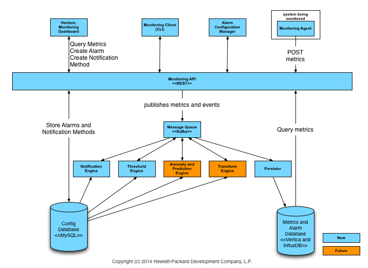

# Introduction

Jahmon is a comprehensive cloud monitoring solution for OpenStack based clouds. It employs node-based agents to report metrics to a centralized collection point, where alarms and notifications are triggered. Monitoring enables users to understand the operational effectiveness of the services and underlying infrastructure that make up their cloud and provide actionable details when there is a problem.

* Target Platform: OpenStack based systems and companies that use OpenStack
* What: Node agent based metrics collection to a centralized cluster
* Benefits: System status and supporting metrics are constantly monitored, readily available, and trackable, making system management tasks more timely and predictable. 
* For Who: System admins or operators

## Goals

* A highly performant, scalable, reliable and fault-tolerant monitoring solution. Performance, scalability and high-availability have been designed in from the start.
* Consolidates and unifies both operational (internal) and Monitoring as a Service (customer facing) capabilities. Service providers usually treat service operations monitoring separately from customer facing Monitoring as a Service (MaaS). This distinction is arbitrary and our solution has been designed to handle both, which dramatically simplifies the number of systems that are required for monitoring. Jahmon is a multi-tenant solution.
* Rest API for posting and querying all metrics and historical information. Most monitoring solution use special transports and protocols, such as CollectD or NSCA (Nagios). In our solution, http is the only protocol used. This simplifies the overall design and also provides a much richer way of describing the data via dimensions.
* Multi-tenant and authenticated. Metrics are submitted and authenticated using an access token and stored associated with a ID.
* Thresholding and alarming on metrics.
* Metrics defined using a set of (key, value) pairs called dimensions.
* Compound alarms using a simple expressive grammar.
* Monitoring agent that support a number of built-in system and service checks and also supports statsd.
* Based on our experiences at HP in monitoring our internal public cloud infrastructure, http://www.hpcloud.com/ as well as running our customer-facing HP Cloud Monitoring, http://www.hpcloud.com/products-services/monitoring.
* Open-source monitoring solution built on open-source technologies.

# Main Components

* Monitoring Agent (mon-agent): A modern Python based monitoring agent that consists of several sub-components and supports system metrics, statsd and many built-in checks for services such as MySQL, RabbitMQ, and many others. 
* Monitoring API (mon-api): A 
* Persister (mon-persister): Consumes metrics and alarm state transitions from the MessageQ and stores them in the Metrics and Alarms database. The Persister uses the Disruptor library, http://lmax-exchange.github.io/disruptor/. We will look into converting the Persister to a Python component in the future.
* Transform and Aggregation Engine: 
* Threshold Engine  (mon-thresh): Computes thresholds on metrics and publishes alarms to the MessageQ when exceeded. Based on Apache Storm a free and open distributed real-time computation system.
* Notification Engine (mon-notification): Consumes alarm state transition messages from the MessageQ and sends notifications, such as emails for alarms. The Notification Engine is Python based.
* Message Queue: A third-party component that primarily receives published metrics from the Monitoring API and alarm state transition messages from the Threshold Engine that are consumed by other components, such as the Persister and Notification Engine. The Message Queue is also used to publish and consume other events in the system. Currently, a Kafka based MessageQ is supported. We will look at other alternatives, such as RabbitMQ. 
* Metrics and Alarms Database: A third-party component that primarily store metrics and the alarm state history. Currently, Vertica is supported. We will look at other alternatives, such as MySQL.
* Config Database: A third-party component that store a lot of the configuration and other information in the system.
* Monitoring Client (python-monclient): A Python command line client that communicates and controls the Monitoring API. The Monitoring Client is written based on the OpenStack Heat Python client.
* Monitoring UI: A Horizon dashboard for visualizing the overall health and status of an OpenStack cloud.

# Post Metric Sequence

# Technologies

Jahmon uses a number of underlying technologies:

* Vertica: Primarily for storing metrics and the alarm history, http://www.vertica.com/
* Apache Kafka: Apache Kafka is publish-subscribe messaging rethought as a distributed commit log, http://kafka.apache.org/
* Apache Storm: Apache Storm is a free and open source distributed realtime computation system. Storm makes it easy to reliably process unbounded streams of data, doing for realtime processing what Hadoop did for batch processing. See http://storm.incubator.apache.org/
* ZooKeeper: Used by Kafka and Storm, http://zookeeper.apache.org/
* MySQL:
* Vagrant: http://www.vagrantup.com/
* Disruptor: http://lmax-exchange.github.io/disruptor/
